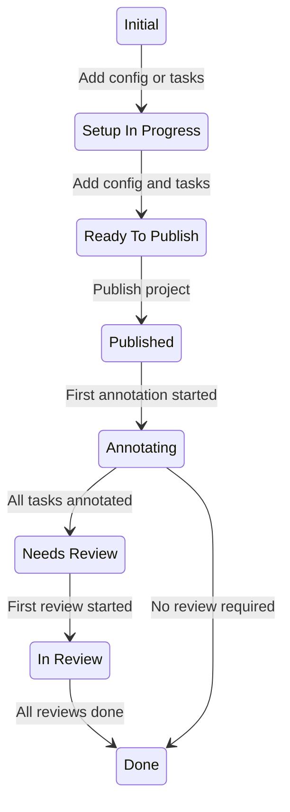
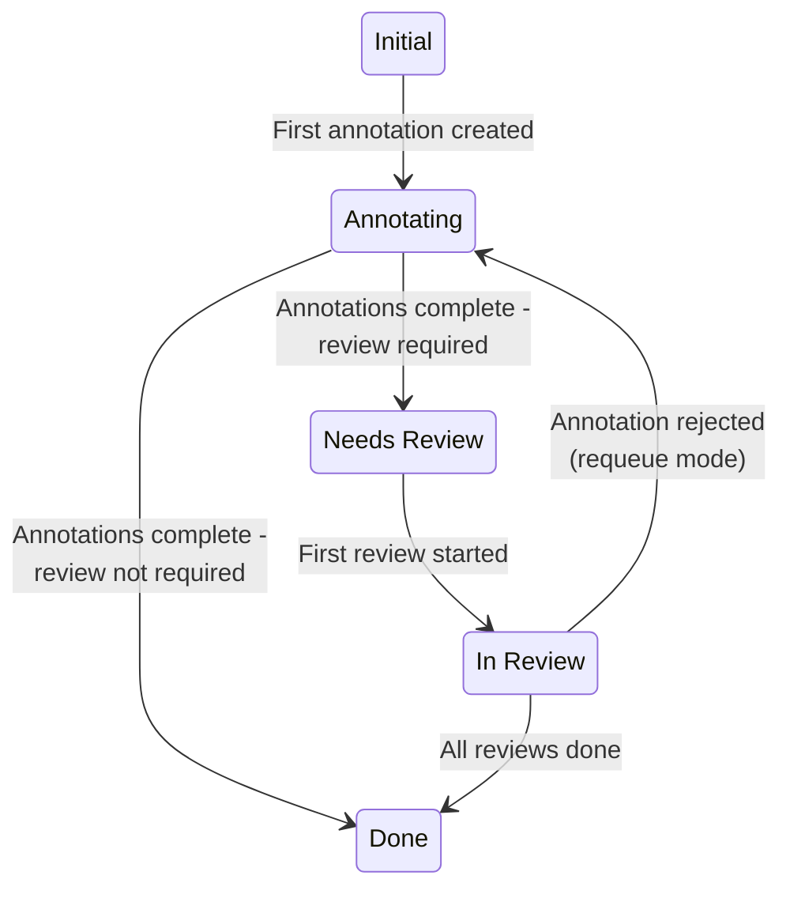

Project and tasks move through a series of states as they progress from their initial created state to completion. 

## Project states

Projects progress through the following states:

| State | Description |
|-----------|---------|
| **Initial** | You have created the project, but you have not created tasks or configured the labeling interface yet. |
| **Setup In Progress** | You have created the project and you have either created tasks or configured the labeling interface, but you have not done both.   If your project is in a Personal Sandbox, it cannot move beyond this state until you move it into a shared workspace.  |
| **Ready to Publish** | Your project has tasks and you have configured the labeling interface, but you have not published the project yet. |
| **Published** | Project is published, but does not have any annotations yet. |
| **Annotating** | At least one task has at least one submitted annotation, meaning annotation work has started. |
| **Needs Review** | All tasks have been annotated by the required number of users, but there are still tasks that need to be reviewed.   Whether your project enters this state depends on your project settings and task states. See [Additional notes](#Additional-notes) below. |
| **In Review** | All tasks have received at least one review, but reviews have not yet been completed for all tasks.   Whether your project enters this state depends on your project settings and task states. See [Additional notes](#Additional-notes) below. |
| **Done** | All tasks have been completed. |

## Task states

| State | Description | 
|----------|------------|
| **Initial** | Task has been created but does not have any annotations yet. |
| **Annotating** | First annotation has been submitted, or a rejected annotation has been requeued back to the annotator.   Whether the task lingers in this state long enough for it to be reflected in the Data Manager depends on your project settings. See [Additional notes](#Additional-notes) below.|
| **Needs Review** | The required number of annotations have been completed and the task is ready for review.   Whether the task enters this state depends on your project settings. See [Additional notes](#Additional-notes) below. |
| **In Review** | First review has been created for any annotation within the task.    Whether the task enters this state depends on your project settings. See [Additional notes](#Additional-notes) below.|
| **Done** | All required annotations and reviews have been completed. |

!!! info Tip
    You can click on the state in the Data Manager to view a history of state changes:

    

    Note that state change history tracking did not start until state management was implemented for your organization. For most MLTL Annotate Cloud organizations, state management was implemented in February 2026. 

## Additional notes

### Project settings and states

Several project settings affect how and if a project/task enters certain states. 

##### Annotating state

The **Annotating** state for tasks is influenced by [**Quality > Overlap of Annotations**](project_settings_lse#overlap). 

If your overlap is `1`, the task immediately progresses to the next state as soon as the first annotation is submitted. 

If your overlap is greater than `1`, the task will sit in the **Annotating** state until you've reached the required number of annotations. 

##### Needs Review state

There are two settings that can cause tasks (and by extension, the project) to skip the **Needs Review** state:

* If you have [**Review > Reviewing Options > Review only manually assigned tasks**](project_settings_lse#reviewing-options) enabled, but have not assigned any reviewers. 
* If you have [**Review > Task Ordering > Random**](project_settings_lse#task-ordering) selected and the **Task limit (%)** set to `0`. 

##### In Review state

The **In Review** state for tasks (and by extension, the project) only happens when:

* Tasks have multiple annotations (meaning an overlap greater than 1). 
* The [**Review > Reviewing Options > Task is reviewed when all annotations are reviewed**](project_settings_lse#reviewing-options) setting is enabled. 

By default, the overall task is considered reviewed if any one of its annotations have been been accepted/rejected. In these situations, the task will move from **Needs Review** to **Done** as soon as one review is submitted. 

If you enable **Task is reviewed when all annotations are reviewed**, the task moves from **Needs Review** to **In Review** after the first review has been submitted, and then **Done** after the final review is submitted. 

### Task state rollup into project state

Once your project reaches the **Published** state, its subsequent states are determined by the state of the tasks within the project. 

The project adopts the **least advanced** state of the tasks.

For example, if you have 10 tasks:
* 1 task is in the **Annotating** state
* 6 tasks are in the **In Review** state
* 3 tasks are in the **Done** state  
  
Your project will be in the **Annotating** state.

##### Initial state exception

The exception is the **Initial** state. For the purposes of the project state rollup, **Initial** tasks are calculated as **Annotating** tasks. 

For example, if you have 10 tasks:

* 5 tasks are in the **Initial** state
* 5 tasks are in the **In Review** state

Your project will be in the **Annotating** state, even though you do not have any tasks in the **Annotating** state.

### API values

If you are using the [SDK](https://api.labelstud.io/api-reference/introduction/getting-started), the API values for each state are as follows. 

Projects:

| Project state | API value | 
|-----------|----------|
| **Initial** | `CREATED` | 
| **Setup In Progress** | `SETUP_IN_PROGRESS` | 
| **Ready to Publish** | `READY_TO_PUBLISH` | 
| **Published** | `PUBLISHED` | 
| **Annotating** | `ANNOTATION_IN_PROGRESS` | 
| **Needs Review** | `NEEDS_REVIEW` | 
| **In Review** | `REVIEW_IN_PROGRESS` | 
| **Done** | `COMPLETED` | 

Tasks:

| Task state | API value | 
|----------|------------|
| **Initial** | `CREATED` | 
| **Annotating** | `ANNOTATION_IN_PROGRESS` | 
| **Needs Review** | `NEEDS_REVIEW` | 
| **In Review** | `REVIEW_IN_PROGRESS` | 
| **Done** | `COMPLETED` | 
